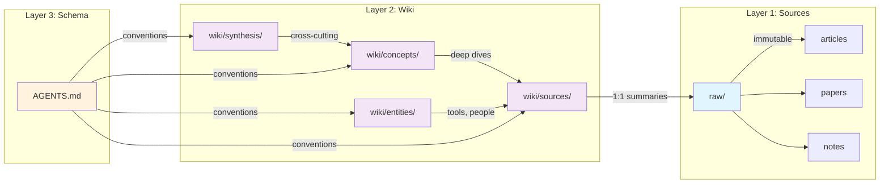

# labs-wiki

A personal LLM-powered knowledge wiki based on [Karpathy's LLM Wiki](https://gist.github.com/karpathy/442a6bf555914893e9891c11519de94f) pattern, enhanced with best-of-breed features from top community implementations.

## How It Works



**Sources** (`raw/`) are immutable documents — articles, papers, notes — captured from any device. The **wiki** (`wiki/`) contains LLM-compiled knowledge pages organized by type. **AGENTS.md** defines the schema and conventions that all AI tools follow.

## Architecture

```
labs-wiki/
├── raw/                    # Layer 1: Immutable source documents
│   └── assets/             # Binary files (images, PDFs)
├── wiki/                   # Layer 2: LLM-compiled knowledge
│   ├── sources/            # Source summaries (1:1 with raw/)
│   ├── concepts/           # Concept deep-dives
│   ├── entities/           # Named entities (tools, people, orgs)
│   ├── synthesis/          # Cross-cutting analysis
│   ├── index.md            # Auto-generated topic-clustered catalog
│   └── log.md              # Structured audit log
├── agents/                 # Agent persona definitions
├── templates/              # Page templates with frontmatter
├── scripts/                # Python utilities (scaffold, lint, index)
├── wiki-ingest-api/        # FastAPI capture service
├── docs/                   # Documentation
├── .github/skills/         # AI skills (6 wiki operations)
├── AGENTS.md               # Universal schema (Layer 3)
└── opencode.json           # OpenCode configuration
```

## Quick Start

```bash
# Clone the repo
git clone https://github.com/jbl306/labs-wiki.git
cd labs-wiki

# Run setup (creates symlinks, validates structure)
./setup.sh

# Add a source
cp ~/Downloads/interesting-paper.pdf raw/assets/
cat > raw/2025-07-17-interesting-paper.md << 'EOF'
---
title: "Interesting Paper"
type: file
captured: 2025-07-17T10:00:00Z
source: manual
tags: [ml, research]
status: pending
---

See `raw/assets/interesting-paper.pdf`
EOF

# Use the wiki-ingest skill to process it
# (in VS Code Copilot, Copilot CLI, or OpenCode)
/wiki-ingest
```

## Capture Sources

Add sources from anywhere — phone, browser, terminal:

| Channel | How |
|---------|-----|
| 📱 Phone | iOS Shortcut / Android Share Sheet → ingest API |
| 💻 Browser | Bookmarklet → ingest API |
| ⌨️ Terminal | `wa url https://...` or `waf paper.pdf` |
| 🔗 GitHub | Create issue with `ingest` label |

See [docs/capture-sources.md](docs/capture-sources.md) for setup instructions.

## Skills

| Skill | Purpose |
|-------|---------|
| `/wiki-setup` | Initialize or validate wiki structure |
| `/wiki-ingest` | Process raw sources into wiki pages |
| `/wiki-query` | Search and synthesize from wiki |
| `/wiki-lint` | Check health: orphans, broken links, staleness |
| `/wiki-update` | Revise pages with provenance tracking |
| `/wiki-orchestrate` | Multi-step workflows |

## Toolchain

Works with all three tools — they all read `AGENTS.md`:

| Tool | Config |
|------|--------|
| VS Code Copilot | `.github/copilot-instructions.md` + `AGENTS.md` |
| Copilot CLI | `AGENTS.md` |
| OpenCode | `opencode.json` + `AGENTS.md` |

## Memory Model

- **Provenance:** every wiki page traces to sources via `sources:` frontmatter
- **Staleness:** pages not verified in 90+ days are flagged
- **Quality:** 0-100 score based on completeness, cross-refs, attribution, recency
- **Tiers:** hot → established → core → workflow (consolidation over time)

See [docs/memory-model.md](docs/memory-model.md) for details.

## Inspiration

Built on research from:
- [Karpathy's LLM Wiki](https://gist.github.com/karpathy/442a6bf555914893e9891c11519de94f) — three-layer architecture
- [rohitg00/agentmemory](https://github.com/rohitg00/agentmemory) — provenance, staleness, quality scoring
- [NicholasSpisak/second-brain](https://github.com/NicholasSpisak/second-brain) — idempotent setup, sub-organization
- [NicholasSpisak/claude-code-subagents](https://github.com/NicholasSpisak/claude-code-subagents) — agent personas

## License

[MIT](LICENSE)
