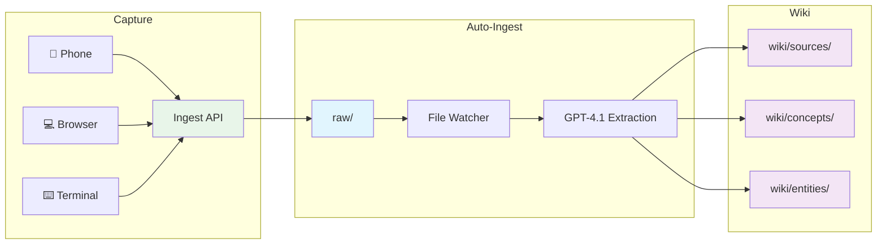

# labs-wiki

A personal LLM-powered knowledge wiki based on [Karpathy's LLM Wiki](https://gist.github.com/karpathy/442a6bf555914893e9891c11519de94f) pattern, enhanced with best-of-breed features from top community implementations.

## How It Works



**Sources** are captured from any device via the Ingest API → written to `raw/` → **automatically processed** by the auto-ingest service (GPT-4.1 via GitHub Models API) → wiki pages created with cross-references. Twitter/X and GitHub repo URLs get specialized extraction; images are analyzed via GPT-4.1 vision. **AGENTS.md** defines the schema that all AI tools follow.

## Architecture

```
labs-wiki/
├── raw/                    # Layer 1: Source documents + durable URL snapshots
│   └── assets/             # Binary files (images, PDFs)
├── wiki/                   # Layer 2: LLM-compiled knowledge
│   ├── sources/            # Source summaries (1:1 with raw/)
│   ├── concepts/           # Concept deep-dives
│   ├── entities/           # Named entities (tools, people, orgs)
│   ├── synthesis/          # Cross-cutting analysis
│   ├── index.md            # Auto-generated topic-clustered catalog
│   └── log.md              # Structured audit log
├── templates/              # Page templates with frontmatter
├── scripts/                # Python utilities (scaffold, lint, index, auto-ingest)
├── wiki-ingest-api/        # FastAPI capture service
├── Dockerfile.auto-ingest  # Auto-ingest watcher service
├── docs/                   # Documentation
├── .github/skills/         # AI skills (6 wiki operations)
├── AGENTS.md               # Universal schema (Layer 3)
└── opencode.json           # OpenCode configuration
```

## Quick Start

```bash
# Clone the repo
git clone https://github.com/jbl306/labs-wiki.git
cd labs-wiki

# Run setup (creates symlinks, validates structure)
./setup.sh

# Add a source (auto-processed by the watcher service within seconds)
cat > raw/2025-07-17-interesting-paper.md << 'EOF'
---
title: "Interesting Paper"
type: file
captured: 2025-07-17T10:00:00Z
source: manual
tags: [ml, research]
status: pending
---

See `raw/assets/interesting-paper.pdf`
EOF

# Sources with status: pending are auto-ingested by the wiki-auto-ingest
# Docker service. Or process manually:
python3 scripts/auto_ingest.py raw/2025-07-17-interesting-paper.md
```

## Capture Sources

Add sources from anywhere — they're automatically processed into wiki pages:

| Channel | How | Processing |
|---------|-----|------------|
| 📱 Phone | iOS Shortcut / Android Share Sheet → ingest API | ⚡ Auto |
| 💻 Browser | Bookmarklet → ingest API | ⚡ Auto |
| ⌨️ Terminal | `wa url https://...` or `waf paper.pdf` | ⚡ Auto |
| 🔗 GitHub | Create issue with `ingest` label | ⚡ Auto |
| 📝 Manual | Create `.md` file in `raw/` | ⚡ Auto |
| 🐦 Twitter/X | Share tweet URL → fxtwitter API extracts text + images | ⚡ Auto |
| 🐙 GitHub Repo | Share repo URL → REST API fetches README + metadata | ⚡ Auto |

The `wiki-auto-ingest` Docker service watches `raw/` and processes new pending sources via GitHub Models within seconds. It now uses **source-aware model routing**: lightweight text-only sources such as Copilot session checkpoint exports can run on a cheaper text model, standard URLs/repos use the default model, and image-bearing sources are routed to the vision-capable lane. Twitter/X and GitHub repo URLs are handled by specialized extractors; images are analyzed only when present. For `type: url` sources, the normalized fetched body is persisted back into a deterministic fetched-content block in `raw/` so later re-ingest can reuse the durable snapshot without a fresh network round-trip.

For targeted reruns:

```bash
# Reprocess one raw file even if it is already marked ingested
python3 scripts/auto_ingest.py raw/2025-07-17-interesting-article.md --project-root . --force

# Re-fetch the live URL and replace the persisted fetched-content block
python3 scripts/auto_ingest.py raw/2025-07-17-interesting-article.md --project-root . --force --refresh-fetch

# Validation rerun: update raw snapshot and pages without polluting wiki/log.md or sending notifications
python3 scripts/auto_ingest.py raw/2025-07-17-interesting-article.md --project-root . --force --refresh-fetch --validation-run
```

`--validation-run` is intended for review-only reruns of a single already-ingested raw file (e.g. verifying
improved extraction quality). It requires `--force`, still writes raw snapshots and wiki pages, but
suppresses the `wiki/log.md` append and ntfy notifications so the audit trail stays clean.

See [docs/capture-sources.md](docs/capture-sources.md) for setup instructions.

## Skills

| Skill | Purpose |
|-------|---------|
| `/wiki-ingest` | Manually process raw sources into wiki pages (auto-ingest handles this normally) |
| `/wiki-query` | Search and synthesize from wiki |
| `/wiki-lint` | Check health: orphans, broken links, staleness |
| `/wiki-update` | Revise pages with provenance tracking |
| `/wiki-orchestrate` | Multi-step workflows (lint, fix, maintenance) |
| `/wiki-setup` | Initialize or validate wiki structure |

## Services

| Service | Purpose |
|---------|---------|
| `wiki-ingest-api` | FastAPI — receives sources from all capture channels |
| `wiki-auto-ingest` | File watcher — auto-processes pending sources via GitHub Models source-aware lanes |

## Toolchain

Works with all three tools — they all read `AGENTS.md`:

| Tool | Config |
|------|--------|
| VS Code Copilot | `.github/copilot-instructions.md` + `AGENTS.md` |
| Copilot CLI | `AGENTS.md` |
| OpenCode | `opencode.json` + `AGENTS.md` |

## Memory Model

- **Provenance:** every wiki page traces to sources via `sources:` frontmatter
- **Staleness:** pages not verified in 90+ days are flagged
- **Quality:** 0-100 score based on structure (completeness, cross-refs, attribution, recency), not execution certainty
- **Tiers:** hot → established → core → workflow (consolidation over time)
- **Checkpoint policy:** Copilot `project-progress` checkpoints are compressed into archived source pages; planning-only checkpoints keep the summary but do not mint standalone concept/entity pages, and checkpoint source pages carry `knowledge_state: planned|executed|validated` separately from structural quality

See [docs/memory-model.md](docs/memory-model.md) for details.

## Knowledge Graph

The knowledge graph links all wiki pages by wikilinks and tier co-occurrence, runs community detection, and identifies checkpoint health.

```bash
# Build the graph and generate the checkpoint tracker report
python3 wiki-graph-api/graph_builder.py \
  --wiki wiki \
  --cache wiki-graph-api/.cache \
  --out wiki/graph/graph.json
```

This writes `wiki/graph/graph.json` and auto-generates `reports/checkpoint-graph-tracker.md`.

### Checkpoint graph tracker

`reports/checkpoint-graph-tracker.md` is a **report-only** file written on every graph build. It compares the graph-derived recommendation (`keep` / `compress` / `merge` / `archive`) against the heuristic baseline from each checkpoint's frontmatter (`checkpoint_class` + `retention_mode`). It does **not** rewrite any wiki page or retention setting. Use it to evaluate whether the graph and heuristic layers agree before deciding on policy changes.

See [docs/workflows.md](docs/workflows.md) for the full graph build workflow.

## Inspiration

Built on research from:
- [Karpathy's LLM Wiki](https://gist.github.com/karpathy/442a6bf555914893e9891c11519de94f) — three-layer architecture
- [rohitg00/agentmemory](https://github.com/rohitg00/agentmemory) — provenance, staleness, quality scoring
- [NicholasSpisak/second-brain](https://github.com/NicholasSpisak/second-brain) — idempotent setup, sub-organization
- [NicholasSpisak/claude-code-subagents](https://github.com/NicholasSpisak/claude-code-subagents) — agent personas

## License

[MIT](LICENSE)
