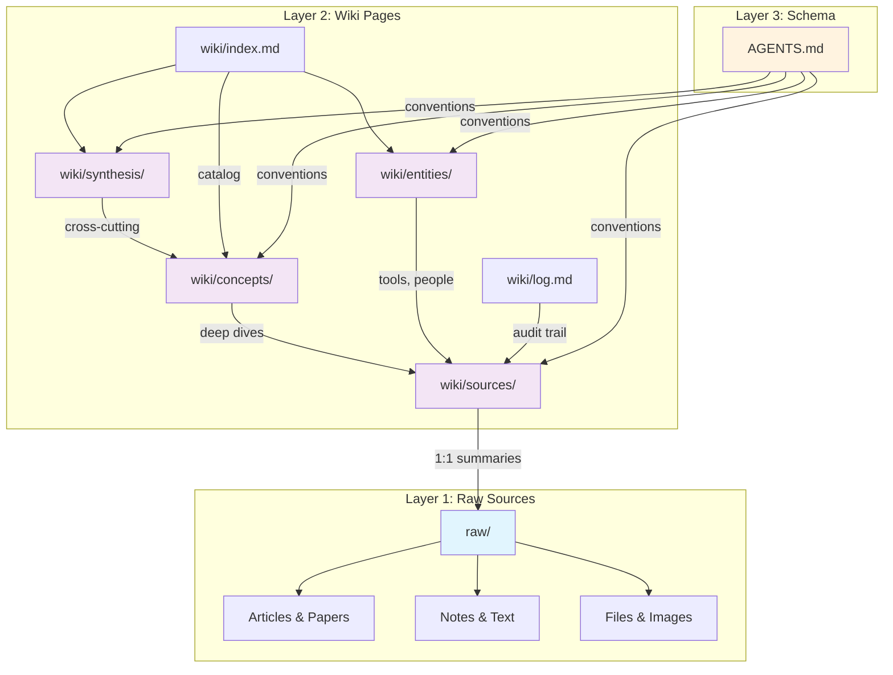
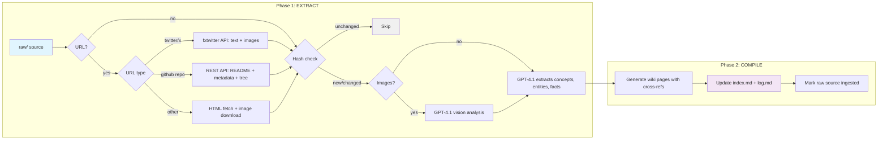
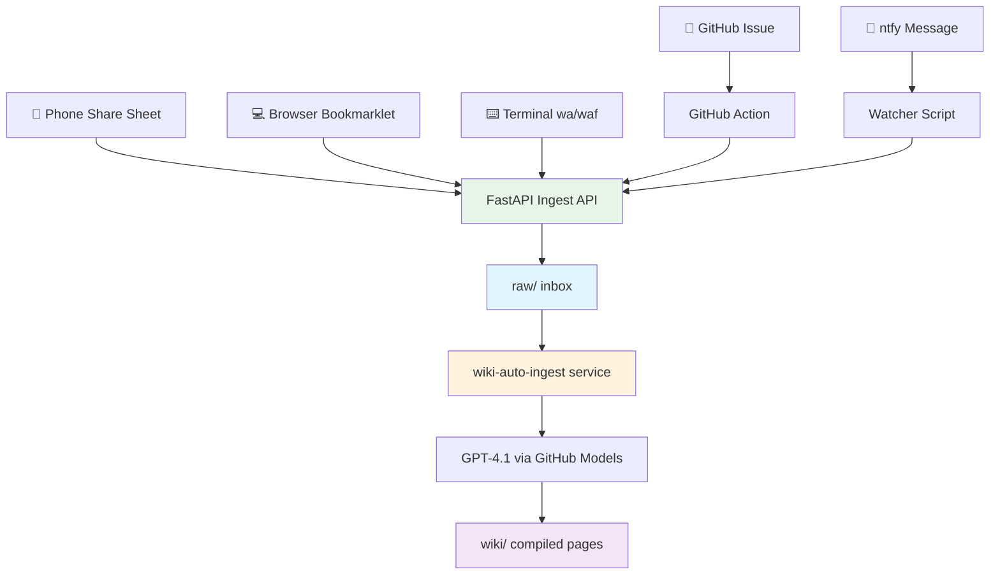

# Architecture

> How labs-wiki works — data flow, layers, and ingestion pipeline.

## Three-Layer Architecture

### Layer 1: Raw Sources (`raw/`)

Immutable source documents. Once a file enters `raw/`, it never changes. This is the "ground truth" that all wiki pages trace back to.

- **Text sources:** `raw/YYYY-MM-DD-<slug>.md` — articles, notes, pasted text
- **Binary files:** `raw/assets/<uuid>.<ext>` — PDFs, images, screenshots
- Each raw file has frontmatter with: `title`, `type`, `captured`, `source`, `status`

### Layer 2: Wiki Pages (`wiki/`)

LLM-compiled knowledge organized into four sub-directories:

| Directory | Content | Relationship to Raw |
|-----------|---------|-------------------|
| `wiki/sources/` | Source summaries | 1:1 with raw files |
| `wiki/concepts/` | Concept deep-dives | 1:many from raw files |
| `wiki/entities/` | Named entities | 1:many from raw files |
| `wiki/synthesis/` | Cross-cutting analysis | many:many synthesis |

Plus two auto-managed files:
- `wiki/index.md` — topic-clustered catalog of all pages
- `wiki/log.md` — structured audit log of all operations

### Layer 3: Schema (`AGENTS.md`)

The universal schema that all AI tools read. Defines conventions, workflows, frontmatter standards, and validation rules. This is the "constitution" of the wiki.

---

## Two-Phase Ingest Pipeline

Sources are automatically processed by the `wiki-auto-ingest` service using GPT-4.1 via GitHub Models API. The pipeline can also be triggered manually via `/wiki-ingest` or `python3 scripts/auto_ingest.py`.

**Phase 1** routes URLs through specialized handlers — Twitter/X URLs use the fxtwitter API (extracts tweet text, author, timestamps, and media), GitHub repo URLs use the REST API (README, metadata, file tree), and all other URLs use standard HTML fetch. Images from any source are analyzed via GPT-4.1 vision (charts, diagrams, screenshots). Shortened t.co URLs are auto-followed. **Phase 2** generates wiki pages from templates, updates cross-references, and rebuilds the index. Hash-based skip ensures sources aren't reprocessed unnecessarily.

---

## Capture Channel Architecture

All capture channels feed into a single FastAPI endpoint. The API writes standardized markdown files to `raw/`. The **`wiki-auto-ingest`** service (watchdog file watcher) detects new files within 5 seconds and automatically processes them via GPT-4.1, creating wiki pages with cross-references. Twitter/X and GitHub repo URLs are routed to specialized handlers; images are analyzed via GPT-4.1 vision.

Manual processing is also available via `/wiki-ingest` skill or `python3 scripts/auto_ingest.py`.

See [capture-sources.md](capture-sources.md) for setup instructions per channel.
