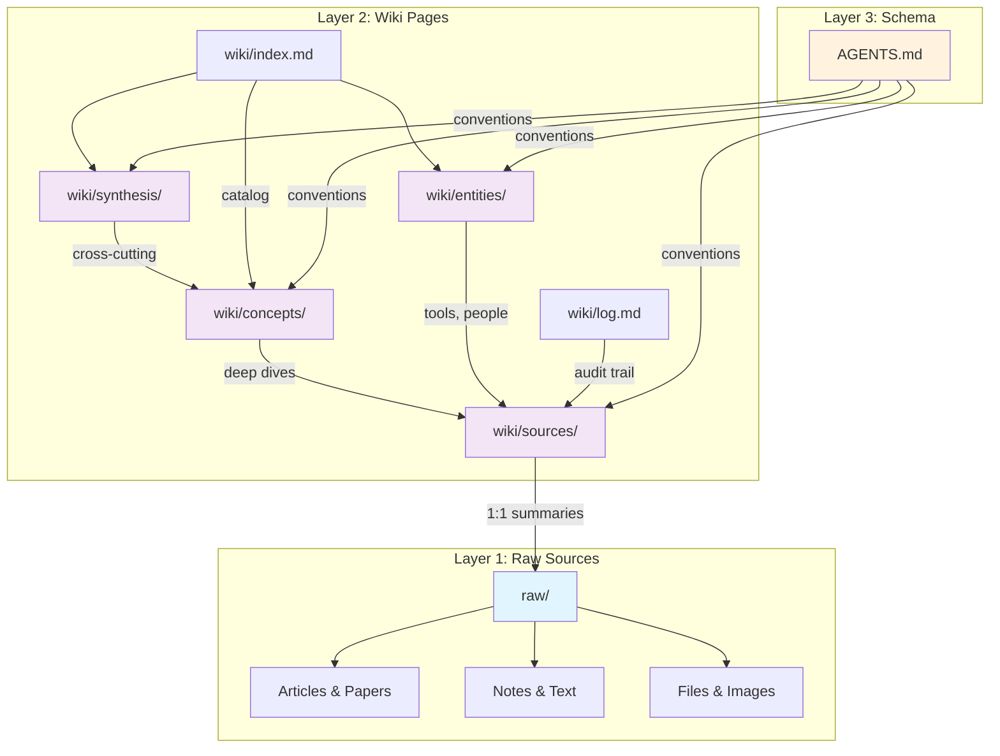
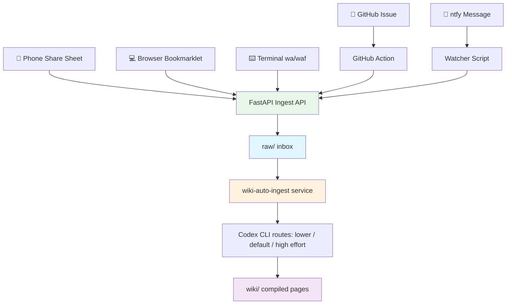

# Architecture

> How labs-wiki works — data flow, layers, and ingestion pipeline.

## Three-Layer Architecture

```mermaid
graph TD
    subgraph "Layer 1: Raw Sources"
        R[raw/] --> A[Articles & Papers]
        R --> N[Notes & Text]
        R --> F[Files & Images]
    end

    subgraph "Layer 2: Wiki Pages"
        S[wiki/sources/] --> |1:1 summaries| R
        C[wiki/concepts/] --> |deep dives| S
        E[wiki/entities/] --> |tools, people| S
        SY[wiki/synthesis/] --> |cross-cutting| C
        I[wiki/index.md] --> |catalog| C
        I --> E
        I --> SY
        L[wiki/log.md] --> |audit trail| S
    end

    subgraph "Layer 3: Schema"
        AG[AGENTS.md] --> |conventions| S
        AG --> |conventions| C
        AG --> |conventions| E
        AG --> |conventions| SY
    end

    style R fill:#e1f5fe
    style S fill:#f3e5f5
    style C fill:#f3e5f5
    style E fill:#f3e5f5
    style SY fill:#f3e5f5
    style AG fill:#fff3e0
```

### Layer 1: Raw Sources (`raw/`)

Captured source content is preserved as the evidence that wiki pages trace back
to. Automation may update ingestion status and replace its own deterministic
fetched-content or extracted-content block; it must not rewrite the original
capture.

- **Text sources:** `raw/YYYY-MM-DD-<slug>.md` — articles, notes, pasted text
- **Binary files:** `raw/assets/<uuid>.<ext>` — PDFs, images, screenshots
- Each raw file has frontmatter with: `title`, `type`, `captured`, `source`, `status`

### Layer 2: Wiki Pages (`wiki/`)

LLM-compiled knowledge organized into four sub-directories:

| Directory | Content | Relationship to Raw |
|-----------|---------|-------------------|
| `wiki/sources/` | Source summaries | 1:1 with raw files |
| `wiki/concepts/` | Concept deep-dives | 1:many from raw files |
| `wiki/entities/` | Named entities | 1:many from raw files |
| `wiki/synthesis/` | Cross-cutting analysis | many:many synthesis |

Plus two auto-managed files:
- `wiki/index.md` — topic-clustered catalog of all pages
- `wiki/log.md` — structured audit log of all operations

### Layer 3: Schema (`AGENTS.md`)

The universal schema that all AI tools read. Defines conventions, workflows, frontmatter standards, and validation rules. This is the "constitution" of the wiki.

---

## Two-Phase Ingest Pipeline

Sources are automatically processed by the `wiki-auto-ingest` service using **Codex CLI source-aware routing**. The pipeline can also be triggered manually via `/wiki-ingest` or `python3 scripts/auto_ingest.py`.

```mermaid
flowchart LR
    subgraph "Phase 1: EXTRACT"
        RAW[raw/ source] --> FETCH{URL?}
        FETCH -->|yes| ROUTE{URL type}
        FETCH -->|no| HASH
        ROUTE -->|twitter/x| TW[fxtwitter API: text + images]
        ROUTE -->|github repo| GH[REST API: README + metadata + tree]
        ROUTE -->|other| HTML[HTML fetch + image download]
        TW --> HASH
        GH --> HASH
        HTML --> HASH
        HASH{Hash check} -->|unchanged| SKIP[Skip]
        HASH -->|new/changed| CLASSIFY{Source class}
        CLASSIFY -->|session / mempalace export| LIGHT[Lower-effort Codex route]
        CLASSIFY -->|standard text / URL| EXTRACT[Default Codex route]
        CLASSIFY -->|PDF / complex repo| IMG[High-effort Codex route]
        LIGHT --> EXTRACT
        IMG --> EXTRACT
    end

    subgraph "Phase 2: COMPILE"
        EXTRACT --> GEN[Generate wiki pages with cross-refs]
        GEN --> SCHEMA[Validate structured status + reported paths]
        SCHEMA --> QUALITY[Strict audit of new synthesis]
        QUALITY --> IDX[Rebuild index.md]
        IDX --> FINALIZE[Orchestrator appends log + marks raw ingested]
        FINALIZE --> COMMIT[Path-limited git commit]
    end

    style SKIP fill:#f0f0f0
    style RAW fill:#e1f5fe
    style IDX fill:#f3e5f5
```

**Phase 1** routes URLs through specialized handlers — Twitter/X URLs use the fxtwitter API (extracts tweet text, author, timestamps, and media), GitHub repo URLs use the REST API (README, metadata, file tree), and all other URLs use standard HTML fetch. Before the model call, the source is classified for priority, checkpoint retention, and reasoning effort. Agent-session checkpoint exports and MemPalace bridge exports prefer the lower-effort path; standard sources use the default path; PDFs and complex repositories receive higher reasoning effort. Shortened t.co URLs are auto-followed. **Phase 2** uses `codex exec` with a JSON output schema and explicit workspace-write sandbox. The Python orchestrator checks the pre/post checkout manifest, validates every backend result against the same schema, contains provenance to existing `raw/*.md` files, applies exact claim-level synthesis gates, and rebuilds the index before owning raw-status/log/notification finalization. Per-source ingestion commits use path-limited `--only` semantics so unrelated staged files are excluded. The current Codex branch is still write-first: Codex edits the checkout before validation, while deterministic hash/fuzzy merge rendering remains in the legacy backend. The target architecture is a read-only typed Codex proposal rendered and published by the backend-neutral Python orchestrator.

---

## Capture Channel Architecture

```mermaid
flowchart TB
    PHONE[📱 Phone Share Sheet] --> API
    BROWSER[💻 Browser Bookmarklet] --> API
    CLI[⌨️ Terminal wa/waf] --> API
    GITHUB[🔗 GitHub Issue] --> ACTION[GitHub Action] --> API
    NTFY[📡 ntfy Message] --> WATCHER[Watcher Script] --> API

    API[FastAPI Ingest API] --> RAW[raw/ inbox]
    RAW --> AUTO[wiki-auto-ingest service]
    AUTO --> LLM[Codex CLI routes: lower / default / high effort]
    LLM --> WIKI[wiki/ compiled pages]

    style API fill:#e8f5e9
    style RAW fill:#e1f5fe
    style AUTO fill:#fff3e0
    style WIKI fill:#f3e5f5
```

Capture channels use the FastAPI text/URL and file-upload endpoints. Both use
the same raw-source writer, which creates files exclusively and retries with
numeric suffixes when a name already exists. Repeated titles and concurrent
captures therefore preserve separate records, and each response returns the
allocated path. The authenticated `/api/debug` endpoint returns only the
request method and body length; capture diagnostics log operational metadata.

The **`wiki-auto-ingest`** service (watchdog file watcher) detects new files within 5 seconds and automatically processes them via Codex CLI, creating wiki pages with cross-references. It prioritizes interactive sources ahead of session backlog, routes Copilot checkpoint exports to lower effort, and raises effort for document-heavy or complex repository sources.

Manual processing is also available via `/wiki-ingest` skill or `python3 scripts/auto_ingest.py`.

See [capture-sources.md](capture-sources.md) for setup instructions per channel.

## Local Reads, Graph Cache, and Audits

The local MCP page tools admit Markdown files only when their resolved paths stay
inside `wiki/`, excluding external symlinks. `wiki_read` tries direct paths and
slugs first. If those miss, one corpus pass checks exact titles and collects
partial filename suggestions.

Graph extraction keys cached pages by relative path and content hash because
node identity and fallback titles depend on the filename. Identical contents
at different paths remain distinct nodes; renaming a page produces a new cache
entry. Caches created with the earlier content-only key miss automatically.

The synthesis audit builds one fresh provenance map per CLI batch and shares
it across pages. Standalone ingestion audits still build fresh provenance.
See the [2026-09-07 review report](../reports/2026-09-07-project-review-and-optimization.md)
for measured results, validation, and remaining corpus issues.
