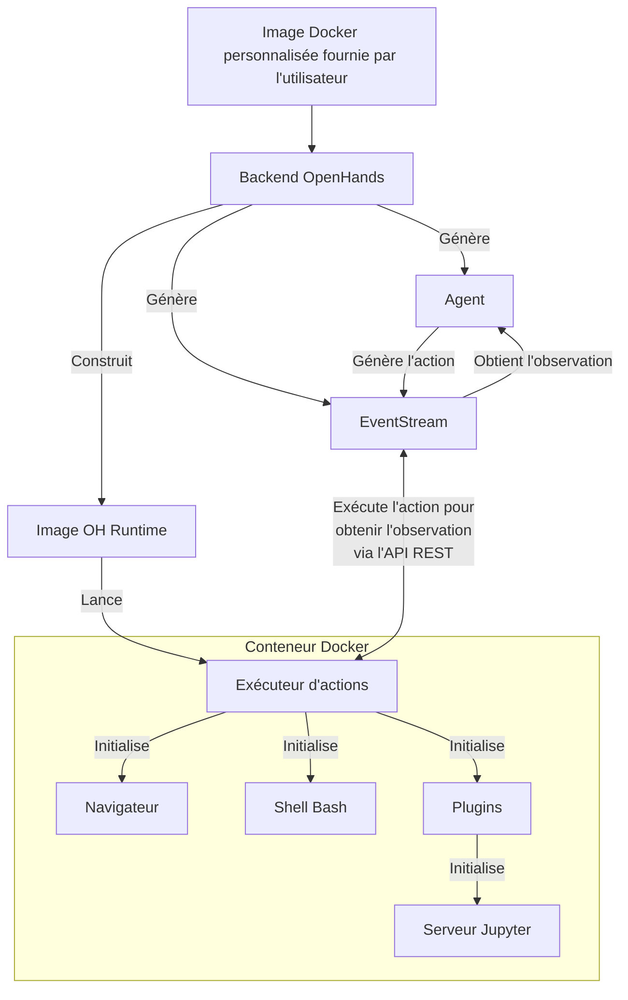

https://github.com/HKUDS/AutoAgent

<!-- fetched-content:start -->
## Fetched Metadata
- fetched_at: 2026-04-21T05:05:08+00:00
- source_url: https://github.com/HKUDS/AutoAgent
- resolved_url: https://github.com/HKUDS/AutoAgent
- content_type: application/vnd.github+json
- image_urls: []

## Fetched Content
Repository: HKUDS/AutoAgent
Description: "AutoAgent: Fully-Automated and Zero-Code LLM Agent Framework"
Stars: 9184
Language: Python
Topics: agent, llms

## README

<a name="readme-top"></a>

<div align="center">
  
  <h1 align="center">AutoAgent: Fully-Automated & Zero-Code</br> LLM Agent Framework </h1>
</div>


<div align="center">
  <a href="https://autoagent-ai.github.io"></a>
  <a href="https://join.slack.com/t/metachain-workspace/shared_invite/zt-2zibtmutw-v7xOJObBf9jE2w3x7nctFQ"></a>
  <a href="https://discord.gg/jQJdXyDB"></a>
  <!-- <a href="https://github.com/HKUDS/AutoAgent/blob/main/assets/autoagent-wechat.jpg"></a> -->
  <a href="./Communication.md"></a>
  <a href="./Communication.md"></a>
  
  <br/>
  <a href="https://autoagent-ai.github.io/docs"></a>
  <a href="https://arxiv.org/abs/2502.05957"></a>
  <a href="https://gaia-benchmark-leaderboard.hf.space/"></a>
  <hr>
</div>

<div align="center">
<a href="https://trendshift.io/repositories/13954" target="_blank"></a>
</div>

Welcome to AutoAgent! AutoAgent is a **Fully-Automated** and highly **Self-Developing** framework that enables users to create and deploy LLM agents through **Natural Language Alone**. 

## ✨Key Features of AutoAgent

* 💬 **Natural Language-Driven Agent Building** 
</br>Automatically constructs and orchestrates collaborative agent systems purely through natural dialogue, eliminating the need for manual coding or technical configuration.

* 🚀 **Zero-Code Framework**
</br>Democratizes AI development by allowing anyone, regardless of coding experience, to create and customize their own agents, tools, and workflows using natural language alone.

* ⚡ **Self-Managing Workflow Generation**
</br>Dynamically creates, optimizes and adapts agent workflows based on high-level task descriptions, even when users cannot fully specify implementation details.

* 🔧 **Intelligent Resource Orchestration**
</br>Enables controlled code generation for creating tools, agents, and workflows through iterative self-improvement, supporting both single agent creation and multi-agent workflow generation.

* 🎯 **Self-Play Agent Customization** 
</br>Enables controlled code generation for creating tools, agents, and workflows through iterative self-improvement, supporting both single agent creation and multi-agent workflow generation.

🚀 Unlock the Future of LLM Agents. Try 🔥AutoAgent🔥 Now!

<div align="center">
  <!--  -->
  <figure>
    
    <figcaption><em>Quick Overview of AutoAgent.</em></figcaption>
  </figure>
</div>


## 🔥 News

<div class="scrollable">
    <ul>
      <li><strong>[2025, Feb 17]</strong>: &nbsp;🎉🎉We've updated and released AutoAgent v0.2.0 (formerly known as MetaChain). Detailed changes include: 1) fix the bug of different LLM providers from issues; 2) add automatic installation of AutoAgent in the container environment according to issues; 3) add more easy-to-use commands for the CLI mode. 4) Rename the project to AutoAgent for better understanding.</li>
      <li><strong>[2025, Feb 10]</strong>: &nbsp;🎉🎉We've released <b>MetaChain!</b>, including framework, evaluation codes and CLI mode! Check our <a href="https://arxiv.org/abs/2502.05957">paper</a> for more details.</li>
    </ul>
</div>
<span id='table-of-contents'/>

## 📑 Table of Contents

* <a href='#features'>✨ Features</a>
* <a href='#news'>🔥 News</a>
* <a href='#how-to-use'>🔍 How to Use AutoAgent</a>
  * <a href='#user-mode'>1. `user mode` (Deep Research Agents)</a>
  * <a href='#agent-editor'>2. `agent editor` (Agent Creation without Workflow)</a>
  * <a href='#workflow-editor'>3. `workflow editor` (Agent Creation with Workflow)</a>
* <a href='#quick-start'>⚡ Quick Start</a>
  * <a href='#installation'>Installation</a>
  * <a href='#api-keys-setup'>API Keys Setup</a>
  * <a href='#start-with-cli-mode'>Start with CLI Mode</a>
* <a href='#todo'>☑️ Todo List</a>
* <a href='#reproduce'>🔬 How To Reproduce the Results in the Paper</a>
* <a href='#documentation'>📖 Documentation</a>
* <a href='#community'>🤝 Join the Community</a>
* <a href='#acknowledgements'>🙏 Acknowledgements</a>
* <a href='#cite'>🌟 Cite</a>

<span id='how-to-use'/>

## 🔍 How to Use AutoAgent

<span id='user-mode'/>

### 1. `user mode` (Deep Research Agents)

AutoAgent features a ready-to-use multi-agent system accessible through user mode on the start page. This system serves as a comprehensive AI research assistant designed for information retrieval, complex analytical tasks, and comprehensive report generation.

- 🚀 **High Performance**: Matches Deep Research using Claude 3.5 rather than OpenAI's o3 model.
- 🔄 **Model Flexibility**: Compatible with any LLM (including Deepseek-R1, Grok, Gemini, etc.)
- 💰 **Cost-Effective**: Open-source alternative to Deep Research's $200/month subscription
- 🎯 **User-Friendly**: Easy-to-deploy CLI interface for seamless interaction
- 📁 **File Support**: Handles file uploads for enhanced data interaction

<div align="center">
  <video width="80%" controls>
    <source src="./assets/video_v1_compressed.mp4" type="video/mp4">
  </video>
  <p><em>🎥 Deep Research (aka User Mode)</em></p>
</div>


<span id='agent-editor'/>

### 2. `agent editor` (Agent Creation without Workflow)

The most distinctive feature of AutoAgent is its natural language customization capability. Unlike other agent frameworks, AutoAgent allows you to create tools, agents, and workflows using natural language alone. Simply choose `agent editor` or `workflow editor` mode to start your journey of building agents through conversations.

You can use `agent editor` as shown in the following figure.

<table>
<tr align="center">
    <td width="33%">
        
        <br>
        <em>Input what kind of agent you want to create.</em>
    </td>
    <td width="33%">
        
        <br>
        <em>Automated agent profiling.</em>
    </td>
    <td width="33%">
        
        <br>
        <em>Output the agent profiles.</em>
    </td>
</tr>
</table>
<table>
<tr align="center">
    <td width="33%">
        
        <br>
        <em>Create the desired tools.</em>
    </td>
    <td width="33%">
        
        <br>
        <em>Input what do you want to complete with the agent. (Optional)</em>
    </td>
    <td width="33%">
        
        <br>
        <em>Create the desired agent(s) and go to the next step.</em>
    </td>
</tr>
</table>

<span id='workflow-editor'/>

### 3. `workflow editor` (Agent Creation with Workflow)

You can also create the agent workflows using natural language description with the `workflow editor` mode, as shown in the following figure. (Tips: this mode does not support tool creation temporarily.)

<table>
<tr align="center">
    <td width="33%">
        
        <br>
        <em>Input what kind of workflow you want to create.</em>
    </td>
    <td width="33%">
        
        <br>
        <em>Automated workflow profiling.</em>
    </td>
    <td width="33%">
        
        <br>
        <em>Output the workflow profiles.</em>
    </td>
</tr>
</table>
<table>
<tr align="center">
    <td width="33%">
        
        <br>
        <em>Input what do you want to complete with the workflow. (Optional)</em>
    </td>
    <td width="33%">
        
        <br>
        <em>Create the desired workflow(s) and go to the next step.</em>
    </td>
</tr>
</table>

<span id='quick-start'/>

## ⚡ Quick Start

<span id='installation'/>

### Installation

#### AutoAgent Installation

```bash
git clone https://github.com/HKUDS/AutoAgent.git
cd AutoAgent
pip install -e .
```

#### Docker Installation

We use Docker to containerize the agent-interactive environment. So please install [Docker](https://www.docker.com/) first. You don't need to manually pull the pre-built image, because we have let Auto-Deep-Research **automatically pull the pre-built image based on your architecture of your machine**.

<span id='api-keys-setup'/>

### API Keys Setup

Create an environment variable file, just like `.env.template`, and set the API keys for the LLMs you want to use. Not every LLM API Key is required, use what you need.

```bash
# Required Github Tokens of your own
GITHUB_AI_TOKEN=

# Optional API Keys
OPENAI_API_KEY=
DEEPSEEK_API_KEY=
ANTHROPIC_API_KEY=
GEMINI_API_KEY=
HUGGINGFACE_API_KEY=
GROQ_API_KEY=
XAI_API_KEY=
```

<span id='start-with-cli-mode'/>

### Start with CLI Mode

> [🚨 **News**: ] We have updated a more easy-to-use command to start the CLI mode and fix the bug of different LLM providers from issues. You can follow the following steps to start the CLI mode with different LLM providers with much less configuration.

#### Command Options:

You can run `auto main` to start full part of AutoAgent, including `user mode`, `agent editor` and `workflow editor`. Btw, you can also run `auto deep-research` to start more lightweight `user mode`, just like the [Auto-Deep-Research](https://github.com/HKUDS/Auto-Deep-Research) project. Some configuration of this command is shown below. 

- `--container_name`: Name of the Docker container (default: 'deepresearch')
- `--port`: Port for the container (default: 12346)
- `COMPLETION_MODEL`: Specify the LLM model to use, you should follow the name of [Litellm](https://github.com/BerriAI/litellm) to set the model name. (Default: `claude-3-5-sonnet-20241022`)
- `DEBUG`: Enable debug mode for detailed logs (default: False)
- `API_BASE_URL`: The base URL for the LLM provider (default: None)
- `FN_CALL`: Enable function calling (default: None). Most of time, you could ignore this option because we have already set the default value based on the model name.
- `git_clone`: Clone the AutoAgent repository to the local environment (only support with the `auto main` command, default: True)
- `test_pull_name`: The name of the test pull. (only support with the `auto main` command, default: 'autoagent_mirror')

#### More details about `git_clone` and `test_pull_name`] 

In the `agent editor` and `workflow editor` mode, we should clone a mirror of the AutoAgent repository to the local agent-interactive environment and let our **AutoAgent** automatically update the AutoAgent itself, such as creating new tools, agents and workflows. So if you want to use the `agent editor` and `workflow editor` mode, you should set the `git_clone` to True and set the `test_pull_name` to 'autoagent_mirror' or other branches.

#### `auto main` with different LLM Providers

Then I will show you how to use the full part of AutoAgent with the `auto main` command and different LLM providers. If you want to use the `auto deep-research` command, you can refer to the [Auto-Deep-Research](https://github.com/HKUDS/Auto-Deep-Research) project for more details.

##### Anthropic

* set the `ANTHROPIC_API_KEY` in the `.env` file.

```bash
ANTHROPIC_API_KEY=your_anthropic_api_key
```

* run the following command to start Auto-Deep-Research.

```bash
auto main # default model is claude-3-5-sonnet-20241022
```

##### OpenAI

* set the `OPENAI_API_KEY` in the `.env` file.

```bash
OPENAI_API_KEY=your_openai_api_key
```

* run the following command to start Auto-Deep-Research.

```bash
COMPLETION_MODEL=gpt-4o auto main
```

##### Mistral

* set the `MISTRAL_API_KEY` in the `.env` file.

```bash
MISTRAL_API_KEY=your_mistral_api_key
```

* run the following command to start Auto-Deep-Research.

```bash
COMPLETION_MODEL=mistral/mistral-large-2407 auto main
```

##### Gemini - Google AI Studio

* set the `GEMINI_API_KEY` in the `.env` file.

```bash
GEMINI_API_KEY=your_gemini_api_key
```

* run the following command to start Auto-Deep-Research.

```bash
COMPLETION_MODEL=gemini/gemini-2.0-flash auto main
```

##### Huggingface

* set the `HUGGINGFACE_API_KEY` in the `.env` file.

```bash
HUGGINGFACE_API_KEY=your_huggingface_api_key
```

* run the following command to start Auto-Deep-Research.

```bash
COMPLETION_MODEL=huggingface/meta-llama/Llama-3.3-70B-Instruct auto main
```

##### Groq

* set the `GROQ_API_KEY` in the `.env` file.

```bash
GROQ_API_KEY=your_groq_api_key
```

* run the following command to start Auto-Deep-Research.

```bash
COMPLETION_MODEL=groq/deepseek-r1-distill-llama-70b auto main
```

##### OpenAI-Compatible Endpoints (e.g., Grok)

* set the `OPENAI_API_KEY` in the `.env` file.

```bash
OPENAI_API_KEY=your_api_key_for_openai_compatible_endpoints
```

* run the following command to start Auto-Deep-Research.

```bash
COMPLETION_MODEL=openai/grok-2-latest API_BASE_URL=https://api.x.ai/v1 auto main
```

##### OpenRouter (e.g., DeepSeek-R1)

We recommend using OpenRouter as LLM provider of DeepSeek-R1 temporarily. Because official API of DeepSeek-R1 can not be used efficiently.

* set the `OPENROUTER_API_KEY` in the `.env` file.

```bash
OPENROUTER_API_KEY=your_openrouter_api_key
```

* run the following command to start Auto-Deep-Research.

```bash
COMPLETION_MODEL=openrouter/deepseek/deepseek-r1 auto main
```

##### DeepSeek

* set the `DEEPSEEK_API_KEY` in the `.env` file.

```bash
DEEPSEEK_API_KEY=your_deepseek_api_key
```

* run the following command to start Auto-Deep-Research.

```bash
COMPLETION_MODEL=deepseek/deepseek-chat auto main
```


After the CLI mode is started, you can see the start page of AutoAgent: 

<div align="center">
  <!--  -->
  <figure>
    
    <figcaption><em>Start Page of AutoAgent.</em></figcaption>
  </figure>
</div>

### Tips

#### Import browser cookies to browser environment

You can import the browser cookies to the browser environment to let the agent better access some specific websites. For more details, please refer to the [cookies](./AutoAgent/environment/cookie_json/README.md) folder.

#### Add your own API keys for third-party Tool Platforms

If you want to create tools from the third-party tool platforms, such as RapidAPI, you should subscribe tools from the platform and add your own API keys by running [process_tool_docs.py](./process_tool_docs.py). 

```bash
python process_tool_docs.py
```

More features coming soon! 🚀 **Web GUI interface** under development.


<span id='todo'/>

## ☑️ Todo List

AutoAgent is continuously evolving! Here's what's coming:

- 📊 **More Benchmarks**: Expanding evaluations to **SWE-bench**, **WebArena**, and more
- 🖥️ **GUI Agent**: Supporting *Computer-Use* agents with GUI interaction
- 🔧 **Tool Platforms**: Integration with more platforms like **Composio**
- 🏗️ **Code Sandboxes**: Supporting additional environments like **E2B**
- 🎨 **Web Interface**: Developing comprehensive GUI for better user experience

Have ideas or suggestions? Feel free to open an issue! Stay tuned for more exciting updates! 🚀

<span id='reproduce'/>

## 🔬 How To Reproduce the Results in the Paper

### GAIA Benchmark
For the GAIA benchmark, you can run the following command to run the inference.

```bash
cd path/to/AutoAgent && sh evaluation/gaia/scripts/run_infer.sh
```

For the evaluation, you can run the following command.

```bash
cd path/to/AutoAgent && python evaluation/gaia/get_score.py
```

### Agentic-RAG

For the Agentic-RAG task, you can run the following command to run the inference.

Step1. Turn to [this page](https://huggingface.co/datasets/yixuantt/MultiHopRAG) and download it. Save them to your datapath.

Step2. Run the following command to run the inference.

```bash
cd path/to/AutoAgent && sh evaluation/multihoprag/scripts/run_rag.sh
```

Step3. The result will be saved in the `evaluation/multihoprag/result.json`.

<span id='documentation'/>

## 📖 Documentation

A more detailed documentation is coming soon 🚀, and we will update in the [Documentation](https://AutoAgent-ai.github.io/docs) page.

<span id='community'/>

## 🤝 Join the Community

We want to build a community for AutoAgent, and we welcome everyone to join us. You can join our community by:

- [Join our Slack workspace](https://join.slack.com/t/AutoAgent-workspace/shared_invite/zt-2zibtmutw-v7xOJObBf9jE2w3x7nctFQ) - Here we talk about research, architecture, and future development.
- [Join our Discord server](https://discord.gg/z68KRvwB) - This is a community-run server for general discussion, questions, and feedback. 
- [Read or post Github Issues](https://github.com/HKUDS/AutoAgent/issues) - Check out the issues we're working on, or add your own ideas.

<span id='acknowledgements'/>


## Misc

<div align="center">

[](https://github.com/HKUDS/AutoAgent/stargazers)

[](https://github.com/HKUDS/AutoAgent/network/members)

[](https://star-history.com/#HKUDS/AutoAgent&Date)

</div>

## 🙏 Acknowledgements

Rome wasn't built in a day. AutoAgent stands on the shoulders of giants, and we are deeply grateful for the outstanding work that came before us. Our framework architecture draws inspiration from [OpenAI Swarm](https://github.com/openai/swarm), while our user mode's three-agent design benefits from [Magentic-one](https://github.com/microsoft/autogen/tree/main/python/packages/autogen-magentic-one)'s insights. We've also learned from [OpenHands](https://github.com/All-Hands-AI/OpenHands) for documentation structure and many other excellent projects for agent-environment interaction design, among others. We express our sincere gratitude and respect to all these pioneering works that have been instrumental in shaping AutoAgent.


<span id='cite'/>

## 🌟 Cite

```tex
@misc{AutoAgent,
      title={{AutoAgent: A Fully-Automated and Zero-Code F

## File: docs/.gitignore

```
# Dependencies
/node_modules

# Production
/build

# Generated files
.docusaurus
.cache-loader

# Misc
.DS_Store
.env.local
.env.development.local
.env.test.local
.env.production.local

npm-debug.log*
yarn-debug.log*
yarn-error.log*

```


## File: docs/babel.config.js

```
module.exports = {
  presets: [require.resolve('@docusaurus/core/lib/babel/preset')],
};

```


## File: docs/DOC_STYLE_GUIDE.md

```
# Documentation Style Guide

## General Writing Principles

- **Clarity & Conciseness**: Always prioritize clarity and brevity. Avoid unnecessary jargon or overly complex explanations.
Keep sentences short and to the point.
- **Gradual Complexity**: Start with the simplest, most basic setup, and then gradually introduce more advanced
concepts and configurations.

## Formatting Guidelines

### Headers

Use **Title Case** for the first and second level headers.

Example:
  - **Basic Usage**
  - **Advanced Configuration Options**

### Lists

When listing items or options, use bullet points to enhance readability.

Example:
  - Option A
  - Option B
  - Option C

### Procedures

For instructions or processes that need to be followed in a specific order, use numbered steps.

Example:
  1. Step one: Do this.
  2. Step two: Complete this action.
  3. Step three: Verify the result.

### Code Blocks

* Use code blocks for multi-line inputs, outputs, commands and code samples.

Example:
```bash
docker run -it \
    -e THIS=this \
    -e THAT=that
    ...
```

```


## File: docs/docs/Dev-Guideline/dev-guide-build-your-project.md

```
---
title: Build Your Project
slug: /dev-guide-build-your-project
---

```


## File: docs/docs/Dev-Guideline/dev-guide-create-agent.md

```
---
title: Create Agent
slug: /dev-guide-create-agent
---

```


## File: docs/docs/Dev-Guideline/dev-guide-create-tools.md

```
---
title: Create Tools
slug: /dev-guide-create-tools
---

```


## File: docs/docs/Dev-Guideline/dev-guide-edit-mem.md

```
---
title: Edit Memory
slug: /dev-guide-edit-memory
---

```


## File: docs/docs/Get-Started/get-started-installation.md

```
---
title: Install Langflow
slug: /get-started-installation
---

```


## File: docs/docs/Get-Started/get-started-quickstart.md

```
---
title: Quickstart
slug: /get-started-quickstart
---


```


## File: docs/docs/Get-Started/welcome-to-autoagent.md

```
---
title: Welcome to AutoAgent
sidebar_position: 0
slug: /
---

Welcome to AutoAgent! AutoAgent is a **Fully-Automated** and highly **Self-Developing** framework that enables users to create and deploy LLM agents through **Natural Language Alone**. 

## ✨Key Features

* 🏆 Top Performer on the GAIA Benchmark
  <br/>AutoAgent has ranked the **#1** spot among open-sourced methods, delivering comparable performance to **OpenAI's Deep Research**.

* 📚 Agentic-RAG with Native Self-Managing Vector Database
  <br/>AutoAgent equipped with a native self-managing vector database, outperforms industry-leading solutions like **LangChain**. 

* ✨ Agent and Workflow Create with Ease
  <br/>AutoAgent leverages natural language to effortlessly build ready-to-use **tools**, **agents** and **workflows** - no coding required.

* 🌐 Universal LLM Support
  <br/>AutoAgent seamlessly integrates with **A Wide Range** of LLMs (e.g., OpenAI, Anthropic, Deepseek, vLLM, Grok, Huggingface ...)

* 🔀 Flexible Interaction 
  <br/>Benefit from support for both **function-calling** and **ReAct** interaction modes.

* 🤖 Dynamic, Extensible, Lightweight 
  <br/>AutoAgent is your **Personal AI Assistant**, designed to be dynamic, extensible, customized, and lightweight.

🚀 Unlock the Future of LLM Agents. Try 🔥AutoAgent🔥 Now!
```


## File: docs/docs/python/python.md

```
# Python Docs

Docs will appear here after deployment.

```


## File: docs/docs/python/sidebar.json

```
{
  "items": ["python/python"],
  "label": "Backend",
  "type": "category"
}

```


## File: docs/docs/Starter-Projects/starter-projects-agentic-rag.md

```
---
title: Agentic RAG
slug: /starter-projects-agentic-rag
---

# Agentic RAG Implementation in AutoAgent

Agentic RAG (Retrieval-Augmented Generation) is an intelligent retrieval system that can decide whether and how to retrieve information from a knowledge base as needed. Traditional RAG methods (such as [chunkRAG](https://github.com/chonkie-ai/chonkie), [MiniRAG](https://github.com/HKUDS/MiniRAG), [LightRAG](https://github.com/HKUDS/LightRAG), and [GraphRAG](https://github.com/microsoft/graphrag)) have limitations as they rely on predefined workflows and struggle to determine if they have acquired sufficient knowledge to answer questions. To make the RAG process more intelligent, we introduce Agentic RAG powered by [AutoAgent](https://github.com/HKUDS/AutoAgent), implementing intelligent storage, retrieval, and response.

## System Architecture

### 1. Required Imports
```python
from constant import DOCKER_WORKPLACE_NAME
from autoagent.environment.docker_container import init_container
from autoagent.io_utils import read_yaml_file, get_md5_hash_bytext
from autoagent.agents import get_rag_agent
from autoagent.core import AutoAgent
from autoagent.environment.docker_env import DockerEnv, DockerConfig, with_env
import argparse
import asyncio
import csv
from tqdm import trange
import os
import json
import time
```

### 2. Environment Configuration
```python
def get_env(container_name: str = 'gaia_test', 
            model: str = 'gpt-4o-mini-2024-07-18',
            git_clone: bool = False, 
            setup_package: str = 'lite_pkgs'):
    workplace_name = DOCKER_WORKPLACE_NAME
    docker_config = DockerConfig(
        container_name=container_name,
        workplace_name=workplace_name,
        communication_port=12345,
        conda_path='/home/user/micromamba'
    )
    docker_env = DockerEnv(docker_config)
    return docker_env
```

The system runs in a Docker container, providing an isolated environment with the following main configurations:
- Container name
- Working directory
- Communication port
- Conda environment path

### 3. RAG Agent Setup
```python
async def main(container_name: str = 'gaia_test', model: str = 'gpt-4o-mini-2024-07-18', git_clone: bool = False, setup_package: str = 'lite_pkgs', test_pull_name: str = 'test_pull_1010', debug: bool = True, task_instructions: str = None):
    workplace_name = DOCKER_WORKPLACE_NAME
    # Docker environment is optional
    # docker_env = get_env(container_name, model, git_clone, setup_package, test_pull_name, debug)
    # docker_env.init_container()

    task_instructions = "YOUR TASK"

    rag_agent = get_rag_agent(model)#, rag_env=docker_env)
    mc = AutoAgent()
```

The system uses the AutoAgent framework to manage RAG agents, with key features including:
- Asynchronous operation support
- Configurable language models
- Flexible message handling mechanism

### 4. Query Processing Flow
```python
context_variables = {
    "working_dir": DOCKER_WORKPLACE_NAME,
    "user_query": task_instructions
}
messages = [{"role": "user", "content": task_instructions}]
response = await mc.run_async(
    agent=codeact_agent, 
    messages=messages,
    max_turns=10, 
    context_variables=context_variables, 
    debug=debug
)
```

Query processing includes the following steps:
1. Setting context variables
2. Building message format
3. Asynchronous agent execution
4. Controlling maximum conversation turns
5. Debug mode support

## Usage

We put a basic usage example in [`AutoAgent/evaluation/multihoprag`](https://github.com/HKUDS/AutoAgent/tree/main/evaluation/multihoprag).


### 1. Basic Usage
```bash
current_dir=$(dirname "$(readlink -f "$0")")

cd $current_dir
cd ../
export DOCKER_WORKPLACE_NAME=workplace_rag
export EVAL_MODE=True
export DEBUG=True
export BASE_IMAGES=tjbtech1/gaia-bookworm:v2
export COMPLETION_MODEL=claude-3-5-sonnet-20241022

python run_rag.py --model gpt-4o-mini-2024-07-18 --container_name gaia_test
```

### 2. Parameter Description
- `--container_name`: Docker container name
- `--model`: Language model to use
- `--git_clone`: Whether to clone code
- `--setup_package`: Package type to install
- `--debug`: Whether to enable debug mode

## Key Features

1. **Asynchronous Processing**: Using `asyncio` for improved processing efficiency
2. **Containerized Deployment**: Using Docker for environment consistency
3. **Flexible Configuration**: Support for various models and parameter configurations
4. **Batch Processing**: Support for batch query processing
5. **Result Tracking**: Saving queries and responses for evaluation and analysis

## Important Notes

1. Ensure proper Docker environment configuration
2. Check model access permissions and configurations
3. Set appropriate maximum conversation turns
4. Maintain data format consistency
5. Regular backup of result files
```


## File: docs/docs/Starter-Projects/starter-projects-auto-deep-research.md

```
---
title: Auto Deep Research
slug: /starter-projects-auto-deep-research
---


```


## File: docs/docs/Starter-Projects/starter-projects-nl-to-agent.md

```
---
title: From Natural Language to Agent
slug: /starter-projects-nl-to-agent
---

```


## File: docs/docs/User-Guideline/user-guide-daily-tasks.md

```
---
title: For Daily Tasks
slug: /user-guide-daily-tasks
---


```


## File: docs/docs/User-Guideline/user-guide-how-to-create-agent.md

```
---
title: How to create an agent with Natural Language
slug: /user-guide-how-to-create-agent
---


```


## File: docs/docusaurus.config.ts

```
import type * as Preset from "@docusaurus/preset-classic";
import type { Config } from "@docusaurus/types";
import { themes as prismThemes } from "prism-react-renderer";

const config: Config = {
  title: "AutoAgent",
  tagline: "Fully-Automated & Zero-Code LLM Agent Framework",
  favicon: "img/metachain_logo.svg",

  // Set the production url of your site here
  url: "https://autoagent-ai.github.io",
  baseUrl: "/",

  // GitHub pages deployment config.
  organizationName: "autoagent-ai",
  projectName: "autoagent-ai.github.io",
  trailingSlash: false,
  deploymentBranch: "main",

  onBrokenLinks: "throw",
  onBrokenMarkdownLinks: "warn",

  markdown: {
    mermaid: true,
  },
  themes: ['@docusaurus/theme-mermaid'],
  presets: [
    [
      "classic",
      {
        docs: {
          path: "docs",
          routeBasePath: "docs",
          sidebarPath: "./sidebars.ts",
          exclude: [
            "**/*.test.{js,jsx,ts,tsx}",
            "**/__tests__/**",
          ],
        },
        blog: {
          showReadingTime: true,
        },
        theme: {
          customCss: "./src/css/custom.css",
        },
      } satisfies Preset.Options,
    ],
  ],
  themeConfig: {
    image: "img/docusaurus.png",
    navbar: {
      title: "AutoAgent",
      logo: {
        alt: "AutoAgent",
        src: "img/metachain_logo.svg",
      },
      items: [
        {
          type: "docSidebar",
          sidebarId: "docsSidebar",
          position: "left",
          label: "Docs",
        },
        {
          href: "https://github.com/HKUDS/AutoAgent",
          label: "GitHub",
          position: "right",
        },
      ],
    },
    prism: {
      theme: prismThemes.oneLight,
      darkTheme: prismThemes.oneDark,
    },
  } satisfies Preset.ThemeConfig,
};

export default config;

```


## File: docs/i18n/fr/code.json

```
{
  "footer.title": {
    "message": "OpenHands"
  },
  "footer.docs": {
    "message": "Documents"
  },
  "footer.community": {
    "message": "Communauté"
  },
  "footer.copyright": {
    "message": "© {year} OpenHands"
  },
  "faq.title": {
    "message": "Questions Fréquemment Posées",
    "description": "FAQ Title"
  },
  "faq.description": {
    "message": "Questions Fréquemment Posées"
  },
  "faq.section.title.1": {
    "message": "Qu'est-ce qu'OpenHands ?",
    "description": "First Section Title"
  },
  "faq.section.highlight": {
    "message": "OpenHands",
    "description": "Highlight Text"
  },
  "faq.section.description.1": {
    "message": "est un ingénieur logiciel autonome qui peut résoudre des tâches d'ingénierie logicielle et de navigation web à tout moment. Il peut exécuter des requêtes en sciences des données, telles que \"Trouver le nombre de demandes de pull à l'repository OpenHands dans les derniers mois\", et des tâches d'ingénierie logicielle, comme \"Veuillez ajouter des tests à ce fichier et vérifier si tous les tests passent. Si ce n'est pas le cas, réparez le fichier.\"",
    "description": "Description for OpenHands"
  },
  "faq.section.description.2": {
    "message": "De plus, OpenHands est une plateforme et communauté pour les développeurs d'agents qui souhaitent tester et évaluer de nouveaux agents.",
    "description": "Further Description for OpenHands"
  },
  "faq.section.title.2": {
    "message": "Support",
    "description": "Support Section Title"
  },
  "faq.section.support.answer": {
    "message": "Si vous rencontrez un problème que d'autres utilisateurs peuvent également avoir, merci de le signaler sur {githubLink}. Si vous avez des difficultés à l'installation ou des questions générales, rejoignez-vous sur {discordLink} ou {slackLink}.",
    "description": "Support Answer"
  },
  "faq.section.title.3": {
    "message": "Comment résoudre un problème sur GitHub avec OpenHands ?",
    "description": "GitHub Issue Section Title"
  },
  "faq.section.github.steps.intro": {
    "message": "Pour résoudre un problème sur GitHub en utilisant OpenHands, envoyez une commande à OpenHands demandant qu'il suit des étapes comme les suivantes :",
    "description": "GitHub Steps Introduction"
  },
  "faq.section.github.step1": {
    "message": "Lisez l'issue https://github.com/All-Hands-AI/OpenHands/issues/1611",
    "description": "GitHub Step 1"
  },
  "faq.section.github.step2": {
    "message": "Cloner le dépôt et vérifier une nouvelle branche",
    "description": "GitHub Step 2"
  },
  "faq.section.github.step3": {
    "message": "Sur la base des instructions dans la description de l'issue, modifiez les fichiers pour résoudre le problème",
    "description": "GitHub Step 3"
  },
  "faq.section.github.step4": {
    "message": "Pousser le résultat à GitHub en utilisant la variable d'environnement GITHUB_TOKEN",
    "description": "GitHub Step 4"
  },
  "faq.section.github.step5": {
    "message": "Dites-moi le lien que je dois utiliser pour envoyer une demande de pull",
    "description": "GitHub Step 5"
  },
  "faq.section.github.steps.preRun": {
    "message": "Avant de lancer OpenHands, vous pouvez faire :",
    "description": "GitHub Steps Pre-Run"
  },
  "faq.section.github.steps.tokenInfo": {
    "message": "où XXX est un jeton GitHub que vous avez créé et qui a les autorisations pour pousser dans le dépôt OpenHands. Si vous n'avez pas d'autorisations de modification du dépôt OpenHands, vous devrez peut-être changer cela en :",
    "description": "GitHub Steps Token Info"
  },
  "faq.section.github.steps.usernameInfo": {
    "message": "où USERNAME est votre nom GitHub.",
    "description": "GitHub Steps Username Info"
  },
  "faq.section.title.4": {
    "message": "Comment OpenHands est-il différent de Devin ?",
    "description": "Devin Section Title"
  },
  "faq.section.openhands.linkText": {
    "message": "Devin",
    "description": "Devin Link Text"
  },
  "faq.section.openhands.description": {
    "message": "est un produit commercial par Cognition Inc., qui a servi d'inspiration initiale pour OpenHands. Les deux visent à bien faire le travail d'ingénierie logicielle, mais vous pouvez télécharger, utiliser et modifier OpenHands, tandis que Devin peut être utilisé uniquement via le site de Cognition. De plus, OpenHands a évolué au-delà de l'inspiration initiale, et est maintenant un écosystème communautaire pour le développement d'agents en général, et nous serions ravis de vous voir rejoindre et",
    "description": "Devin Description"
  },
  "faq.section.openhands.contribute": {
    "message": "contribuer",
    "description": "Contribute Link"
  },
  "faq.section.title.5": {
    "message": "Comment OpenHands est-il différent de ChatGPT ?",
    "description": "ChatGPT Section Title"
  },
  "faq.section.chatgpt.description": {
    "message": "ChatGPT vous pouvez accéder en ligne, il ne se connecte pas aux fichiers locaux et ses capacités d'exécution du code sont limitées. Alors qu'il peut écrire du code, mais c'est difficile à tester ou à exécuter.",
    "description": "ChatGPT Description"
  },
  "homepage.description": {
    "message": "Génération d'code AI pour l'ingénierie logicielle.",
    "description": "The homepage description"
  },
  "homepage.getStarted": {
    "message": "Commencer"
  },
  "welcome.message": {
    "message": "Bienvenue à OpenHands, un système d'IA autonome ingénieur logiciel capable d'exécuter des tâches d'ingénierie complexes et de collaborer activement avec les utilisateurs sur les projets de développement logiciel."
  },
  "theme.ErrorPageContent.title": {
    "message": "Cette page a planté.",
    "description": "The title of the fallback page when the page crashed"
  },
  "theme.BackToTopButton.buttonAriaLabel": {
    "message": "Retourner en haut de la page",
    "description": "The ARIA label for the back to top button"
  },
  "theme.blog.archive.title": {
    "message": "Archives",
    "description": "The page & hero title of the blog archive page"
  },
  "theme.blog.archive.description": {
    "message": "Archives",
    "description": "The page & hero description of the blog archive page"
  },
  "theme.blog.paginator.navAriaLabel": {
    "message": "Pagination des listes d'articles du blog",
    "description": "The ARIA label for the blog pagination"
  },
  "theme.blog.paginator.newerEntries": {
    "message": "Nouvelles entrées",
    "description": "The label used to navigate to the newer blog posts page (previous page)"
  },
  "theme.blog.paginator.olderEntries": {
    "message": "Anciennes entrées",
    "description": "The label used to navigate to the older blog posts page (next page)"
  },
  "theme.blog.post.paginator.navAriaLabel": {
    "message": "Pagination des articles du blog",
    "description": "The ARIA label for the blog posts pagination"
  },
  "theme.blog.post.paginator.newerPost": {
    "message": "Article plus récent",
    "description": "The blog post button label to navigate to the newer/previous post"
  },
  "theme.blog.post.paginator.olderPost": {
    "message": "Article plus ancien",
    "description": "The blog post button label to navigate to the older/next post"
  },
  "theme.blog.post.plurals": {
    "message": "Un article|{count} articles",
    "description": "Pluralized label for \"{count} posts\". Use as much plural forms (separated by \"|\") as your language support (see https://www.unicode.org/cldr/cldr-aux/charts/34/supplemental/language_plural_rules.html)"
  },
  "theme.blog.tagTitle": {
    "message": "{nPosts} tags avec « {tagName} »",
    "description": "The title of the page for a blog tag"
  },
  "theme.tags.tagsPageLink": {
    "message": "Voir tous les tags",
    "description": "The label of the link targeting the tag list page"
  },
  "theme.colorToggle.ariaLabel": {
    "message": "Basculer entre le mode sombre et clair (actuellement {mode})",
    "description": "The ARIA label for the navbar color mode toggle"
  },
  "theme
```


## File: docs/i18n/fr/docusaurus-plugin-content-blog/options.json

```
{
  "title": {
    "message": "Blog",
    "description": "The title for the blog used in SEO"
  },
  "description": {
    "message": "Blog",
    "description": "The description for the blog used in SEO"
  },
  "sidebar.title": {
    "message": "Articles récents",
    "description": "The label for the left sidebar"
  }
}

```


## File: docs/i18n/fr/docusaurus-plugin-content-docs/current.json

```
{
  "version.label": {
    "message": "Next",
    "description": "The label for version current"
  },
  "sidebar.docsSidebar.category.🤖 Backends LLM": {
    "message": "🤖 Backends LLM",
    "description": "The label for category 🤖 Backends LLM in sidebar docsSidebar"
  },
  "sidebar.docsSidebar.category.🚧 Dépannage": {
    "message": "🚧 Dépannage",
    "description": "The label for category 🚧 Dépannage in sidebar docsSidebar"
  },
  "sidebar.apiSidebar.category.Backend": {
    "message": "Backend",
    "description": "The label for category Backend in sidebar apiSidebar"
  }
}

```


## File: docs/i18n/fr/docusaurus-plugin-content-docs/current/python/python.md

```


# Documentation Python

La documentation apparaîtra ici après le déploiement.

```


## File: docs/i18n/fr/docusaurus-plugin-content-docs/current/python/sidebar.json

```
{
  "items": ["python/python"],
  "label": "Backend",
  "type": "categorie"
}

```


## File: docs/i18n/fr/docusaurus-plugin-content-docs/current/usage/about.md

```


# À propos d'OpenHands

## Stratégie de recherche

La réplication complète d'applications de niveau production avec des LLM est une entreprise complexe. Notre stratégie implique :

1. **Recherche technique fondamentale :** Se concentrer sur la recherche fondamentale pour comprendre et améliorer les aspects techniques de la génération et de la gestion du code
2. **Capacités spécialisées :** Améliorer l'efficacité des composants de base grâce à la curation des données, aux méthodes d'entraînement, et plus encore
3. **Planification des tâches :** Développer des capacités pour la détection des bugs, la gestion des bases de code et l'optimisation
4. **Évaluation :** Établir des métriques d'évaluation complètes pour mieux comprendre et améliorer nos modèles

## Agent par défaut

Notre Agent par défaut est actuellement le [CodeActAgent](agents), qui est capable de générer du code et de gérer des fichiers.

## Construit avec

OpenHands est construit en utilisant une combinaison de frameworks et de bibliothèques puissants, fournissant une base solide pour son développement. Voici les principales technologies utilisées dans le projet :

       

Veuillez noter que la sélection de ces technologies est en cours et que des technologies supplémentaires peuvent être ajoutées ou des technologies existantes peuvent être supprimées à mesure que le projet évolue. Nous nous efforçons d'adopter les outils les plus appropriés et les plus efficaces pour améliorer les capacités d'OpenHands.

## Licence

Distribué sous la [Licence](https://github.com/All-Hands-AI/OpenHands/blob/main/LICENSE) MIT.

```


## File: docs/i18n/fr/docusaurus-plugin-content-docs/current/usage/agents.md

```


# 🧠 Agent Principal et Capacités

## CodeActAgent

### Description

Cet agent implémente l'idée de CodeAct ([article](https://arxiv.org/abs/2402.01030), [tweet](https://twitter.com/xingyaow_/status/1754556835703751087)) qui consolide les **act**ions des agents LLM dans un espace d'action de **code** unifié à la fois pour la _simplicité_ et la _performance_.

L'idée conceptuelle est illustrée ci-dessous. À chaque tour, l'agent peut :

1. **Converser** : Communiquer avec les humains en langage naturel pour demander des clarifications, des confirmations, etc.
2. **CodeAct** : Choisir d'effectuer la tâche en exécutant du code

- Exécuter n'importe quelle commande Linux `bash` valide
- Exécuter n'importe quel code `Python` valide avec [un interpréteur Python interactif](https://ipython.org/). Ceci est simulé via une commande `bash`, voir le système de plugin ci-dessous pour plus de détails.


### Démo

https://github.com/All-Hands-AI/OpenHands/assets/38853559/f592a192-e86c-4f48-ad31-d69282d5f6ac

_Exemple de CodeActAgent avec `gpt-4-turbo-2024-04-09` effectuant une tâche de science des données (régression linéaire)_.

```


## File: docs/i18n/fr/docusaurus-plugin-content-docs/current/usage/architecture/runtime.md

```


# 📦 Runtime Docker

Le Runtime Docker d'OpenHands est le composant principal qui permet l'exécution sécurisée et flexible des actions des agents d'IA.
Il crée un environnement en bac à sable (sandbox) en utilisant Docker, où du code arbitraire peut être exécuté en toute sécurité sans risquer le système hôte.

## Pourquoi avons-nous besoin d'un runtime en bac à sable ?

OpenHands doit exécuter du code arbitraire dans un environnement sécurisé et isolé pour plusieurs raisons :

1. Sécurité : L'exécution de code non fiable peut poser des risques importants pour le système hôte. Un environnement en bac à sable empêche le code malveillant d'accéder ou de modifier les ressources du système hôte
2. Cohérence : Un environnement en bac à sable garantit que l'exécution du code est cohérente sur différentes machines et configurations, éliminant les problèmes du type "ça fonctionne sur ma machine"
3. Contrôle des ressources : Le bac à sable permet un meilleur contrôle de l'allocation et de l'utilisation des ressources, empêchant les processus incontrôlés d'affecter le système hôte
4. Isolation : Différents projets ou utilisateurs peuvent travailler dans des environnements isolés sans interférer les uns avec les autres ou avec le système hôte
5. Reproductibilité : Les environnements en bac à sable facilitent la reproduction des bugs et des problèmes, car l'environnement d'exécution est cohérent et contrôlable

## Comment fonctionne le Runtime ?

Le système Runtime d'OpenHands utilise une architecture client-serveur implémentée avec des conteneurs Docker. Voici un aperçu de son fonctionnement :



1. Entrée utilisateur : L'utilisateur fournit une image Docker de base personnalisée
2. Construction de l'image : OpenHands construit une nouvelle image Docker (l'"image OH runtime") basée sur l'image fournie par l'utilisateur. Cette nouvelle image inclut le code spécifique à OpenHands, principalement le "client runtime"
3. Lancement du conteneur : Lorsqu'OpenHands démarre, il lance un conteneur Docker en utilisant l'image OH runtime
4. Initialisation du serveur d'exécution des actions : Le serveur d'exécution des actions initialise un `ActionExecutor` à l'intérieur du conteneur, mettant en place les composants nécessaires comme un shell bash et chargeant les plugins spécifiés
5. Communication : Le backend OpenHands (`openhands/runtime/impl/eventstream/eventstream_runtime.py`) communique avec le serveur d'exécution des actions via une API RESTful, envoyant des actions et recevant des observations
6. Exécution des actions : Le client runtime reçoit les actions du backend, les exécute dans l'environnement en bac à sable et renvoie les observations
7. Retour des observations : Le serveur d'exécution des actions renvoie les résultats d'exécution au backend OpenHands sous forme d'observations


Le rôle du client :
- Il agit comme un intermédiaire entre le backend OpenHands et l'environnement en bac à sable
- Il exécute différents types d'actions (commandes shell, opérations sur les fichiers, code Python, etc.) en toute sécurité dans le conteneur
- Il gère l'état de l'environnement en bac à sable, y compris le répertoire de travail courant et les plugins chargés
- Il formate et renvoie les observations au backend, assurant une interface cohérente pour le traitement des résultats


## Comment OpenHands construit et maintient les images OH Runtime

L'approche d'OpenHands pour la construction et la gestion des images runtime assure l'efficacité, la cohérence et la flexibilité dans la création et la maintenance des images Docker pour les environnements de production et de développement.

Consultez le [code pertinent](https://github.com/All-Hands-AI/OpenHands/blob/main/openhands/runtime/utils/runtime_build.py) si vous souhaitez plus de détails.

### Système de balises d'images

OpenHands utilise un système à trois balises pour ses images runtime afin d'équilibrer la reproductibilité et la flexibilité.
Les balises peuvent être dans l'un des 2 formats suivants :

- **Balise versionnée** : `oh_v{openhands_version}_{base_image}` (ex : `oh_v0.9.9_nikolaik_s_python-nodejs_t_python3.12-nodejs22`)
- **Balise de verrouillage** : `oh_v{openhands_version}_{16_digit_lock_hash}` (ex : `oh_v0.9.9_1234567890abcdef`)
- **Balise source** : `oh_v{openhands_version}_{16_digit_lock_hash}_{16_digit_source_hash}`
  (ex : `oh_v0.9.9_1234567890abcdef_1234567890abcdef`)


#### Balise source - La plus spécifique

Il s'agit des 16 premiers chiffres du MD5 du hash du répertoire pour le répertoire source. Cela donne un hash
uniquement pour la source d'openhands


#### Balise de verrouillage

Ce hash est construit à partir des 16 premiers chiffres du MD5 de :
- Le nom de l'image de base sur laquelle l'image a été construite (ex : `nikola
<!-- fetched-content:end -->
